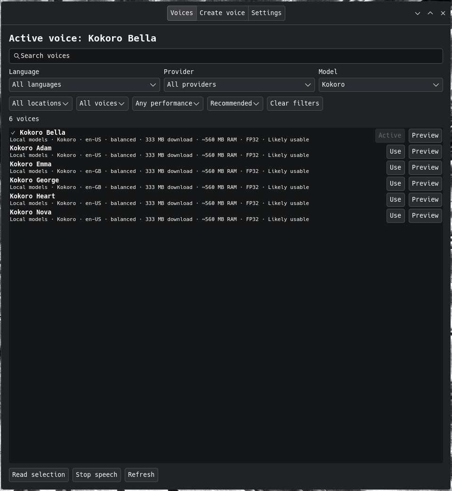

# UtterMux


[](https://github.com/anaxonda/uttermux-linux/actions/workflows/linux.yml)

Use local and online text-to-speech voices everywhere on Linux.

UtterMux is a model-agnostic TTS broker behind Speech Dispatcher. It presents
local inference engines and network services through one catalog, routing, and
cancellation interface; a persistent background process owns model lifetime,
provider sessions, caching, and audio streaming independently of any client.

The companion [Android system TTS engine](https://github.com/anaxonda/uttermux-android)
uses the same catalog contract and routing concepts.

> **Status:** beta. Arch Linux is the development platform; Debian trixie and
> alternate-prefix source builds run in CI. Release automation publishes
> checksum-verified Arch and Debian x86-64 packages. No neural model weights are bundled.



## Why UtterMux?

Linux TTS tools usually support one engine or one application. UtterMux keeps
Speech Dispatcher as the compatibility layer and puts model management,
provider credentials, automatic language routing, cloning, caching, and
cancellation behind it.

```text
SSIP / Speech Dispatcher clients
              │
         sd_uttermux
              │
          uttermuxd
   ┌─────────┼──────────┼──────────┐
 local models   Edge service   hosted APIs
```

The GTK application has the same four top-level areas as the Android app:

- **Voices** — search, filter, download, preview, and choose a default voice.
- **Create voice** — create and manage Pocket, ZipVoice, or ElevenLabs clones.
- **Test & tune** — benchmark exact installed artifacts, adjust per-model
  settings, and select the tested voice.
- **Settings** — configure providers, routing, model caching, and diagnostics.

The GTK application and CLI operate on the same catalog and configuration.

## Features

- A standard Speech Dispatcher interface for desktop applications and Web
  Speech implementations that use the system speech service.
- Persistent local models, bounded LRU model caching, and optional startup
  preload for the active voice.
- Local and cloud voices in one searchable catalog.
- eSpeak NG system voices for fast, small, multilingual offline speech without
  downloading a neural model.
- BCP-47 language metadata, automatic language detection, per-language routes,
  and configurable fallback order.
- System-wide selected-text reading on Wayland and X11.
- Voice preview and local model downloads.
- Pocket and ZipVoice local cloning plus ElevenLabs Instant Voice Cloning.
- Tray icon that opens the normal application.
- Optional compatibility adapter for clients that use the legacy localhost
  PCM protocol instead of Speech Dispatcher.
- Cancellation without changing voices halfway through an utterance.

## Models available in the Linux app

Every row below is implemented and appears in the Linux model catalog. The app
can install and run each artifact. ZipVoice does not expose a preset system
voice; it becomes selectable after the user creates or imports a voice profile.
MOSS and Qwen use maintained companion installers instead of the sherpa-onnx
archive installer. No row in this table describes Android support.

Downloads occur only after an install action. Sizes are compressed transfer
sizes; RAM is a catalog estimate used by the UI's advisory filter, not a
measurement on the reader's computer.

### Cross-platform local support

“Yes” means the released app exposes an install and synthesis path. “Profile”
means a reference recording must be configured before a system voice exists.

| Family | Linux | Android | Current boundary |
| --- | --- | --- | --- |
| eSpeak NG | Installed system engine; 100+ languages/accents | Embedded engine and language data | Formant synthesis; no model download |
| Piper/VITS | Yes; generated pinned catalog | Yes; generated pinned catalog | Fixed voices |
| Inflect Nano/Micro | Nano | Nano and Micro | Fixed English voices |
| Kitten | FP16 v0.1 and INT8 v0.8 | FP16 v0.1 and INT8 v0.8 | Fixed English voices |
| Matcha | Yes | Yes | LJSpeech + Vocos artifact |
| Supertonic 3 | INT8 | INT8 | Multilingual styles |
| Pocket | Yes; presets and profiles | Yes; presets and profiles | Reference-conditioned cloning |
| Kokoro | v1.0 FP32 | v1.0 and v1.1 FP32 | INT8 and FP8 are not included |
| ZipVoice Distill | Profile; INT8 | No | Linux requires reference audio and transcript |
| MOSS-TTS-Nano | Companion adapter; FP32 | FP32; explicit heavy download | Benchmark before sustained reading |
| Qwen3-TTS 0.6B | Companion adapter; CustomVoice | Base Q4_K_M device preview; cloning profiles | Separate persistent Linux and GGUF Android runtimes |

The hand-maintained artifact table previously in this README was incomplete.
The [generated local artifact index](docs/MODELS.generated.md) is the
authoritative overview of release-pinned variants and links to the complete
machine-readable catalog. Multi-speaker runtimes can expose more voices than
the explicit interoperability records counted by that page. See
[catalog architecture](docs/CATALOG.md) for how it is produced and synchronized
with Android.

## Model variants not included in the Linux app

Kokoro v1.1 INT8 is published upstream but has no UtterMux Linux catalog entry.
UtterMux also has no tested Kokoro FP8 artifact or FP8 runtime configuration.
That is an implementation status, not a claim that FP8 cannot run on other
hardware or through another ONNX Runtime execution provider. A new artifact is
added only after its model files, execution provider, runtime configuration,
checksum, license, and synthesis path are verified together.

## Online provider support

Hosted services are adapters rather than generated model artifacts. When a
provider exposes voice discovery, UtterMux fetches the account's current voice
list when the broker starts; services without discovery use documented defaults
or voice IDs configured by the user. Cloud voices are therefore not frozen into
the generated local-model catalog.

| Provider | Authentication | Linux | Android |
| --- | --- | --- | --- |
| Microsoft Edge Read Aloud | none | Implemented | Implemented |
| [ElevenLabs](https://elevenlabs.io/docs/api-reference/text-to-speech/stream) | API key | Implemented; account voices and cloning | Implemented; account voices |
| [xAI / Grok](https://docs.x.ai/docs/guides/text-to-speech) | API key | Implemented | Implemented |
| [OpenAI-compatible](https://platform.openai.com/docs/guides/text-to-speech) | API key, endpoint, model | Implemented | Implemented |
| [Azure Speech](https://learn.microsoft.com/azure/ai-services/speech-service/rest-text-to-speech) | resource key and region/endpoint | Implemented; live catalog | Implemented |
| [Qwen / DashScope](https://www.alibabacloud.com/help/en/model-studio/qwen-tts) | API key, region, workspace | Implemented; HTTP API and separate local Qwen | Implemented |
| [Google Cloud TTS](https://cloud.google.com/text-to-speech/docs/reference/rest) | restricted API key or proxy | Implemented; live catalog | Implemented |
| [Amazon Polly](https://docs.aws.amazon.com/polly/latest/dg/API_Reference.html) | SigV4, Cognito, or proxy | Implemented; live catalog | Implemented |
| [Deepgram](https://developers.deepgram.com/docs/tts-rest) | API key | Implemented; Aura 2 REST | Implemented |
| [Cartesia](https://docs.cartesia.ai/api-reference/tts/bytes) | API key | Implemented; live catalog | Implemented |
| [PlayHT](https://docs.play.ht/reference/api-generate-tts-audio-stream) | provider credentials | Implemented; live catalog | Implemented |
| [Resemble](https://docs.resemble.ai/api-reference/text-to-speech/stream-synthesize) | provider credentials | Implemented; configured voice UUIDs | Implemented |
| Custom PCM endpoint | HTTPS endpoint and bearer token | Implemented | Implemented |

“Implemented” means a provider adapter and voice path are present. Paid and
account-specific services still require credentials and may not be covered by
the project's public CI. They are never enabled as implicit fallbacks.

Exact endpoint paths, authentication headers, language fields, audio formats,
rate ranges, proxy behavior, and credential guidance are documented in
[Cloud provider contracts](docs/cloud-providers.md).

Configure a service under **Settings → Online providers**, then enable it. The
CLI equivalent accepts a JSON object on standard input and stores it mode 0600;
it does not place secrets in `config.toml` or command-line arguments:

```sh
printf '%s' '{"api_key":"…","region":"eastus"}' | uttermux provider-config azure
uttermux provider enable azure
```

MOSS-TTS-Nano uses a persistent, cancellable two-stage adapter. Generation and
codec decoding run concurrently through bounded queues; unlike the upstream
long-form helper, UtterMux does not add fixed silence between text chunks. A
warm benchmark reached RTF 0.86 and first PCM in 0.66 seconds on the i7-8650U
test system. It is installed only by an explicit model-install action because
its 728 MiB transfer and roughly 1.4 GiB working set are substantial. See
[MOSS benchmark notes](docs/moss-benchmarks.md).

On the documented i7-8650U CPU benchmark, Qwen3-TTS 0.6B did not sustain
real-time generation. The result characterizes that runtime and hardware
combination, not Qwen support on newer CPUs or supported accelerators. The
current UtterMux adapter is CPU-only; benchmark each installed artifact before
using it for continuous narration.
See [Qwen benchmark notes](docs/qwen-benchmarks.md).

## Install

### Arch Linux

Install the latest GitHub release:

```sh
curl --proto '=https' --tlsv1.2 -fsSL \
  https://github.com/anaxonda/uttermux-linux/raw/main/install.sh | bash
```

The script downloads and verifies the prebuilt x86-64 package, installs it with
`pacman`, runs `uttermux setup`, and finishes with `uttermux doctor`. On an
architecture without a published binary it verifies the release `PKGBUILD` and
builds the pinned sources with `makepkg`. Set `UTTERMUX_FORCE_SOURCE=1` to
choose that path explicitly. Review
[`install.sh`](install.sh) before piping it to a shell.

To download and verify every pinned Arch source without building or installing,
run the command with `UTTERMUX_INSTALL_CHECK_ONLY=1`.

### Debian and Ubuntu

The same one-line command verifies and installs the published amd64 `.deb` with
`apt`. Other architectures fall back to installing build dependencies and the
verified release-source build under `/usr/local`:

```sh
curl --proto '=https' --tlsv1.2 -fsSL \
  https://github.com/anaxonda/uttermux-linux/raw/main/install.sh | bash
```

Review [`scripts/install-debian`](scripts/install-debian) and
[`scripts/install-source`](scripts/install-source) before running them.

### Other distributions

Install a C++17 compiler, CMake, Ninja, pkg-config, Speech Dispatcher module
headers, Rubber Band, FFmpeg, GTK 4/PyGObject, and Python 3. Then use the generic
release-source installer; `UTTERMUX_PREFIX` defaults to `/usr/local`:

```sh
curl --proto '=https' --tlsv1.2 -fsSL \
  https://github.com/anaxonda/uttermux-linux/raw/main/scripts/install-source | bash
```

The generic installer verifies the published source checksum, builds the pinned
sherpa-onnx runtime, runs tests, and invokes `sudo` only for installation.
Set `UTTERMUX_INSTALL_CHECK_ONLY=1` to verify the release archive without
building or installing it.

Installer builds use two concurrent compiler jobs to avoid exhausting memory on
smaller systems. Set `UTTERMUX_BUILD_JOBS` to a positive integer to override
that limit, for example `UTTERMUX_BUILD_JOBS=8` on a suitable build machine.

### Build from source

Install build and runtime dependencies:

```sh
sudo pacman -S --needed \
  speech-dispatcher libspeechd rubberband onnxruntime-cpu \
  cmake ninja gcc git pkgconf python curl ffmpeg \
  python-gobject gtk4 python-numpy python-aiohttp python-certifi
```

UtterMux currently requires sherpa-onnx 1.13.6 or newer built with its TTS C
API. Once `libsherpa-onnx-c-api.so` is installed, build UtterMux:

```sh
cd uttermux
cmake -S . -B build -G Ninja
cmake --build build
ctest --test-dir build --output-on-failure
sudo cmake --install build
sudo ldconfig
uttermux setup
```

Clone or download this repository first, then run the commands from its root.
`uttermux setup` configures the Speech Dispatcher module and enables the
socket-activated broker and tray user services. Existing model paths are
migrated without deleting the old configuration.

After upgrading from a user-local prototype, check `type -a uttermux`. An old
`~/.local/bin/uttermux` can precede the packaged executable in `PATH`; rename or
remove that obsolete copy before running `uttermux setup`.

Run a health check:

```sh
uttermux doctor
spd-say 'UtterMux is ready.'
```

Restart Firefox and Zotero after first installation so they enumerate the new
system voices.

## Everyday use

Open the manager from the application menu or run:

```sh
uttermux-app
```

To test an installed local voice in the manager, open **Voices**, press
**Preview**, and watch the inline loading/playing indicator. Press **Test
model** on that voice—or open **Test & tune**—to compare CPU-thread settings.
The benchmark shows cold/warm first-audio latency, real-time factor (RTF), and
peak memory, then asks before applying its proposed setting. It neither
downloads another model nor evaluates voice quality. **Use as active voice** on
the same test row selects that exact tested voice.

Useful CLI commands:

```sh
uttermux voices
uttermux status --json
uttermux model list
uttermux model install vits-inflect-en-nano-v2
uttermux model install moss-tts-nano-100m-onnx
uttermux preview sherpa/vits-inflect-en-nano-v2/default
uttermux benchmark sherpa/vits-inflect-en-nano-v2/default --runs 3
uttermux tune sherpa/vits-inflect-en-nano-v2/default
uttermux default sherpa/vits-inflect-en-nano-v2/default
uttermux speak-selection
uttermux speak-selection --clipboard
uttermux doctor
```

Bind `uttermux speak-selection` to a desktop shortcut. It reads the current
primary selection using `wl-paste`, `xclip`, or `xsel`. The tray menu can also
read the selection or stop current speech.

For slower-loading local models such as Kokoro, enable **Settings → Global defaults →
Preload active local voice**. This spends RAM at login but removes model loading
from the first request. It cannot remove the time the model needs to synthesize
the first sentence.

Advanced performance controls are available in both Settings and the CLI:

| Setting | Fresh default | Effect |
| --- | ---: | --- |
| `local-threads` | Automatic | Uses up to 4 CPU threads per local sherpa model |
| `pocket-threads` | Automatic | Uses up to 2 CPU threads; Pocket can regress with excess parallelism |
| `local-silence-scale` | 0.2 | Scales pauses generated inside one local utterance |
| `pocket-num-steps` | 3 | Pocket quality/latency tradeoff |
| `pocket-chunk-size` | 4 | Pocket continuity/responsiveness tradeoff |
| `zipvoice-num-steps` | 4 | ZipVoice quality/latency tradeoff |
| `moss-threads` | Automatic | Uses up to 2 threads for each concurrent MOSS ONNX stage |
| `moss-batch-frames` | 4 | MOSS first-audio latency versus decode throughput |
| `external-idle-seconds` | 120 | Releases Qwen/MOSS process memory after inactivity; zero keeps it resident |
| `max-loaded-models` | Automatic | Keeps one model below 8 GiB total RAM, otherwise two |

Zero means Automatic in the config and GUI; the CLI also accepts `auto` for
thread settings. For example, `uttermux setting local-threads 2` applies a
device-specific override, while `uttermux setting local-threads auto` restores
automatic selection. Both reload the broker. The automatic policy is a safe
starting point based on engine behavior and available cores/RAM, not an attempt
to predict the fastest setting for every processor. Benchmark documents report
the exact reference hardware and should not be read as universal tuning advice.

The GUI batches all global changes and reloads only once. To change only one
installed artifact, open **Test & tune → Model settings**. Manual model settings
take precedence over a saved benchmark profile; a saved profile takes precedence
over global defaults and automatic selection. Playback buffering, model-cache
size, language routing, and cloud caching remain global.
The panel is engine-aware: all sherpa artifacts expose threads and generated
silence; Pocket adds refinement and decoder chunk size, ZipVoice adds generation
steps, and MOSS adds decode batching. Every row reports its effective value and
source and can be reset independently.

The same controls are scriptable. Values omitted from the JSON object inherit:

```sh
uttermux model-setting replace kokoro-multi-lang-v1_1 '{"threads": 4, "silence_scale": 0.15}'
uttermux model-setting list kokoro-multi-lang-v1_1
uttermux model-setting reset kokoro-multi-lang-v1_1
```

MOSS has independent settings because increasing the normal sherpa thread count
does not tune its concurrent generator/decoder pipeline.

## Model variants and custom models

Catalog entries represent concrete artifacts, not only model families. FP32,
FP16, INT8, size, or quality variants can coexist when each has a verified
runtime configuration. The manager shows transfer size, estimated working
memory, quantization, and an advisory performance class, and can sort by
download or RAM.
The manager combines those fields with detected CPU features and available
memory and labels each artifact **Recommended here**, **Likely usable**, **May
be slow**, or with a memory warning. Those labels are deterministic heuristics
derived from logical CPU count, available RAM, catalog RAM estimates, and the
catalog performance class. They are not benchmark results. The current Linux
release configures ONNX Runtime's CPU execution provider and does not implement
GPU selection. Labels do not download, disable, or hide artifacts.

Inspect the non-identifying local capability report with:

```sh
uttermux hardware --json
```

Measure broker synthesis without audio-device playback:

```sh
uttermux benchmark "Kokoro Bella" --runs 3 --json
```

Repeated MOSS and Qwen benchmarks require the model estimate plus 2 GiB of
currently available host memory. The CLI refuses a heavy run below that margin;
`--force-low-memory` is available for controlled testing where an out-of-memory
kill is acceptable.

The report contains time to first PCM, synthesis wall time, generated audio
duration, and real-time factor (RTF). Run 1 includes model initialization only
when that model was not already warm; later runs measure the warm path. The
command does not control CPU frequency, temperature, or background load.
Published results should state the machine, text, thread settings, and whether
the broker was restarted.

The **Tune** page and `uttermux tune VOICE` compare thread counts for one exact
installed artifact. Benchmark requests carry an ephemeral override and never
rewrite the active configuration. The smallest thread count within 5% of the
fastest measured RTF is proposed; apply it only after review:

```sh
uttermux tuning apply vits-inflect-en-nano-v2 2
uttermux tuning reset vits-inflect-en-nano-v2
```

Profiles are artifact-specific and record the catalog checksum, broker
protocol, and tuning-runtime revision. FP32, FP16, INT8, and GGUF variants therefore retain independent
measurements. Performance results cannot determine pronunciation, missing
phonemes, artifacts, or preferred voice quality; use the adjacent Preview
buttons to compare variants before changing the default voice.

Use [`docs/custom-models.md`](docs/custom-models.md) for a complete schema-1
Piper/VITS manifest and verification commands. The production C++ parser tests
that example. The GTK GUI does not yet import custom manifests.

## Distribution support

Arch Linux is the development target. Tagged releases build an x86-64 Arch
package and an amd64 Debian trixie package after the source tests pass. Debian's
multiarch helper layout and `/usr/lib/speech-dispatcher-modules` loader path are
validated separately from Arch. The source installer supports other current
systemd-based distributions after their C++17, GTK 4, Speech Dispatcher 0.12+,
Rubber Band, FFmpeg, and Python dependencies are installed. Fedora, openSUSE,
NixOS, Flatpak, and non-systemd sessions do not yet have native packages.
`/usr/local` and alternate `lib64` prefixes are exercised by CI.

## Language routing

Applications may declare a language. Otherwise, UtterMux detects sufficiently
long text and tries:

1. the selected global voice when it supports that language;
2. the exact and base-language routes configured by the user;
3. enabled providers in the configured order;
4. the cross-language fallback, if enabled.

Short or uncertain text uses the configured default language. Language tags are
always normalized to BCP-47 form such as `en-US` and `fr-FR`.

Examples:

```sh
uttermux default --language fr elevenlabs/VOICE_ID
uttermux detect 'Ceci est un paragraphe français suffisamment long.'
uttermux routes
```

## Configuring online providers

Providers and credentials can be configured in the GTK Settings page. Keys are
stored in mode-0600 files rather than the main configuration or process command
line.

```sh
# ElevenLabs
printf '%s\n' 'YOUR_API_KEY' | uttermux credential-set elevenlabs
uttermux provider enable elevenlabs

# xAI / Grok
printf '%s\n' 'YOUR_API_KEY' | uttermux credential-set grok
uttermux provider enable grok

# Edge locales exposed to desktop applications
uttermux edge-locales en-US en-GB fr-FR
uttermux provider enable edge
```

Edge uses an unofficial endpoint that may change upstream. Paid-provider use can
incur charges; UtterMux does not manage quotas or billing.

## Voice cloning

Only clone a voice when you have the necessary rights and consent.

```sh
# Pocket: one to ten useful seconds of reference audio
uttermux profile-create pocket --name 'My reader' --language en-US \
  --audio reference.wav

# ZipVoice: reference audio plus its exact transcript
uttermux profile-create zipvoice --name 'My bilingual reader' --language en-US \
  --audio reference.wav --transcript 'The exact words in the recording.'

# ElevenLabs Instant Voice Clone
uttermux elevenlabs-clone --name 'My cloud voice' --language en-US \
  --audio sample-one.wav --audio sample-two.wav --confirm-rights
```

Local profiles can be exported and imported as `.uttermux-voice` bundles:

```sh
uttermux profile-export PROFILE_ID my-reader.uttermux-voice
uttermux profile-import my-reader.uttermux-voice
```

Reference recordings are normalized to mono PCM and stored with user-only
permissions under `~/.local/share/uttermux/voice-profiles`.
Prepared runtime data is stored as named, checksummed schema-2 artifacts beside
the recording. Schema-1 voice bundles remain importable.

## Legacy localhost compatibility adapter

The optional adapter preserves the localhost PCM API used by some reader
plugins while delegating voice selection and routing to UtterMux. Applications
that already use Speech Dispatcher do not need it:

```sh
systemctl --user disable --now koreader-tts-edge.service
systemctl --user enable --now uttermux-koreader.service
```

Do not run both services because both listen on port 5000. By default the bridge
follows the global UtterMux voice and language fallbacks.

## Configuration and data

| Purpose | Default location |
| --- | --- |
| Configuration | `~/.config/uttermux/config.toml` |
| Provider credentials | `~/.config/uttermux/credentials/` |
| Model manifests | `~/.config/uttermux/models.d/` |
| Downloaded models | `~/.local/share/uttermux/models/` |
| Local voice profiles | `~/.local/share/uttermux/voice-profiles/` |
| UI state | `~/.local/state/uttermux/ui.json` |

The broker owns synthesis and configuration. The GTK process can be closed;
Speech Dispatcher clients and the optional localhost adapter continue to work
through socket-activated user services.

## Development

```sh
cmake --build build
ctest --test-dir build --output-on-failure
python -m unittest discover -s tests -v
python -m py_compile cli/uttermux daemon/uttermuxd.py ui/uttermux-app.py
```

Architecture and benchmark notes:

- [Android/desktop catalog contract](docs/DESKTOP_PARITY.md)
- [Catalog generation and synchronization](docs/CATALOG.md)
- [Catalog schema v2](docs/interop/catalog-v2.schema.json)
- [Generated local artifact index](docs/MODELS.generated.md)
- [MOSS-TTS-Nano experiments](docs/moss-benchmarks.md)
- [Kokoro runtime experiments](docs/kokoro-benchmarks.md)
- [Pocket TTS runtime experiments](docs/pocket-benchmarks.md)
- [Qwen3-TTS experiments](docs/qwen-benchmarks.md)
- [Saved benchmark format](docs/benchmark-format.md)
- [Gated runtime candidates](docs/runtime-candidates.md)

### Maintainer screenshots

`scripts/capture-linux-screenshots` renders all four GTK pages against a
deterministic fixture. On Arch its capture-only dependencies are
`xorg-server-xvfb`, `xorg-xwininfo`, and `imagemagick`; synthesis is not run.

Related projects and design references:

- [Speech Dispatcher](https://github.com/brailcom/speechd) defines the Linux
  SSIP boundary and external-module API.
- [sherpa-onnx](https://github.com/k2-fsa/sherpa-onnx) supplies the shared local
  inference API and model exports.
- [Pied](https://github.com/Elleo/pied) demonstrated desktop Piper management
  through Speech Dispatcher.
- [voicego](https://github.com/Ravino/voicego) is an independent SSIP server
  with isolated engines and streaming PCM.
- [NekoSpeak](https://github.com/siva-sub/NekoSpeak) informed the separation of
  synthesis, bounded buffering, playback, and cancellation.
- [HayaiTTS](https://github.com/HayaiApp/HayaiTTS) is a similar Android system
  engine built around sherpa-onnx and a large offline catalog.
- [qwen3-tts.cpp](https://github.com/Danmoreng/qwen3-tts.cpp) provides the
  GGML/GGUF C++ and JNI runtime used by the Android Qwen experiment;
  [qwen3-tts-android](https://github.com/Danmoreng/qwen3-tts-android)
  demonstrates it as an Android system engine.
- [qwen3-tts-apple-silicon](https://github.com/kapi2800/qwen3-tts-apple-silicon),
  [qwen3-tts](https://github.com/gabriele-mastrapasqua/qwen3-tts), and
  [swift-qwen3-tts](https://github.com/AtomGradient/swift-qwen3-tts) are
  independent MLX/Metal deployment references for Apple silicon.
- [PocketTTS.cpp](https://github.com/VolgaGerm/PocketTTS.cpp) informed the
  experimental Pocket pipeline and prepared-reference cache measurements.
- [speech-android](https://github.com/soniqo/speech-android) documents a
  bounded short-turn Kokoro graph and its required split/retry safeguards.
- [tts-onnx](https://github.com/runableapp/tts-onnx) is a Linux ONNX TTS daemon
  and service deployment reference.
- [Read Aloud](https://github.com/ken107/read-aloud) covers many browser cloud
  providers; its provider contracts informed UtterMux's online adapters.

Contributions should keep stable voice IDs, BCP-47 language metadata,
cancellation, and application highlighting semantics intact. A provider must
not fall back after it has emitted audio, because that would mix voices within
one highlighted utterance.

## License

UtterMux is GPL-3.0-or-later. Models, provider services, and packaged
dependencies retain their own licenses and terms. See
[model and service licensing](docs/MODEL_LICENSES.md) and the
[security policy](SECURITY.md).
