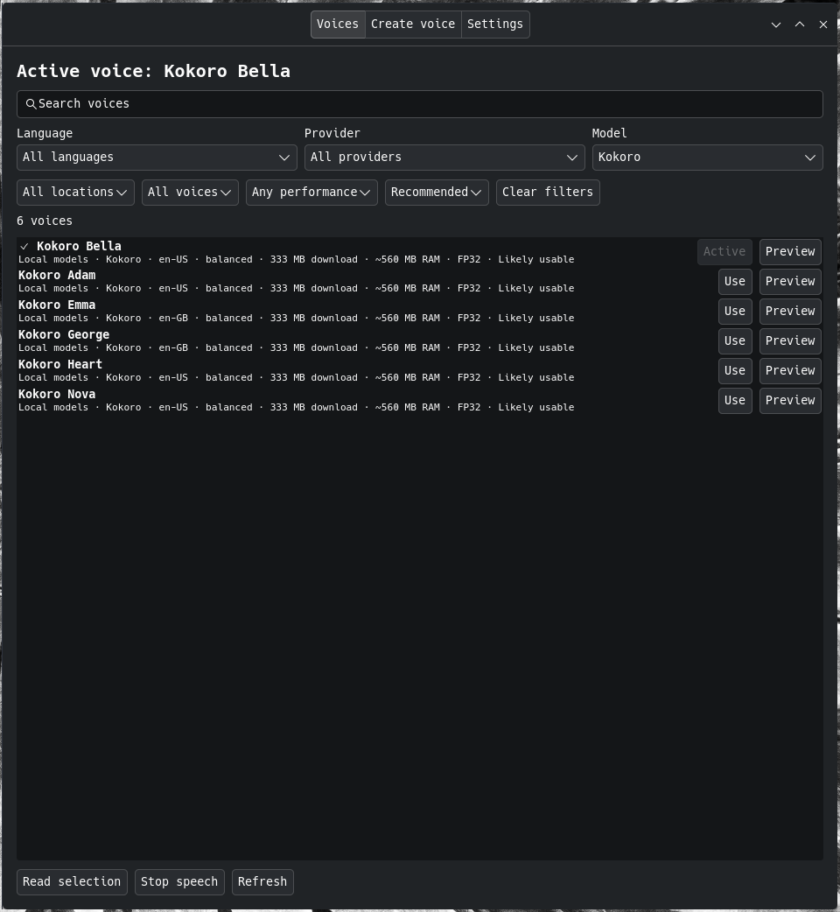

# UtterMux


[](https://github.com/anaxonda/uttermux-linux/actions/workflows/linux.yml)

UtterMux is a model-agnostic text-to-speech broker for Linux. It exposes local
models and online services through Speech Dispatcher, so compatible applications
share one voice catalog, default voice, language-routing policy, and cancellation
interface.

```text
Speech Dispatcher clients
          │
     sd_uttermux
          │
      uttermuxd
   ┌──────┼───────────┐
local models   hosted services
```

The persistent broker owns model lifetime, provider sessions, caching, and PCM
streaming. The GTK manager is optional during synthesis.

> **Status:** beta. Arch Linux is the development platform; release automation
> also publishes Debian/Ubuntu amd64 packages. Neural model weights are downloaded
> only on request.



The companion [Android system TTS engine](https://github.com/anaxonda/uttermux-android)
uses the same catalog schema and routing model.

## Capabilities

- Native Speech Dispatcher output module and persistent synthesis broker.
- MPRIS play/pause/stop controls for audio played by the compatibility service.
  Firefox, Zotero, and other Speech Dispatcher clients retain ownership of
  their own queues and transport state.
- Searchable local/cloud voice catalog with previews, favorites, downloads,
  installed sizes, and model removal.
- BCP-47 metadata, automatic language detection, per-language routes, and
  ordered fallbacks.
- Local model caching, startup preload, cancellation, rate/pitch handling, and
  per-artifact benchmarking/tuning.
- Pocket and ZipVoice local profiles; ElevenLabs voice cloning.
- GTK manager, tray launcher, CLI, and selected-text shortcut for Wayland/X11.
- Optional localhost PCM adapter for legacy reader integrations.

## Local engines

Every Linux entry below has a synthesis path in the released catalog. “Profile”
requires a user-supplied reference recording. See the
[generated artifact index](docs/MODELS.generated.md) for exact variants, sizes,
checksums, languages, voices, licenses, and upstream links.

| Family | Linux support | Android support |
| --- | --- | --- |
| eSpeak NG | System engine; 100+ languages/accents | Embedded |
| Piper/VITS | Generated pinned catalog | Generated pinned catalog |
| Inflect | Nano | Nano and Micro |
| Kitten | FP16 v0.1; INT8 v0.8 | FP16 v0.1; INT8 v0.8 |
| Matcha | LJSpeech + Vocos | LJSpeech + Vocos |
| Supertonic 3 | INT8 | INT8 |
| Pocket | Presets and profiles | Presets and profiles |
| Kokoro | v1.0 FP32 | v1.0 and v1.1 FP32 |
| ZipVoice Distill | INT8; profile | Not released |
| MOSS-TTS-Nano | FP32 companion adapter | Explicit heavy download |
| Qwen3-TTS 0.6B | CustomVoice companion adapter | Q4_K_M device preview |

Kokoro INT8/FP8 and other unlisted variants are not runnable catalog entries.
Variant admission requires a pinned artifact, compatible runtime configuration,
checksum, license metadata, and synthesis tests. Candidate runtimes are tracked
in [runtime-candidates.md](docs/runtime-candidates.md).

## Online services

Cloud voices are discovered at runtime where the provider supports discovery.
They are never implicit fallbacks and may incur provider charges.

| Provider | Authentication |
| --- | --- |
| Microsoft Edge Read Aloud | none; unofficial endpoint |
| ElevenLabs, xAI/Grok, Deepgram, Cartesia | API key |
| OpenAI-compatible | API key, endpoint, model |
| Azure Speech | resource key and region/endpoint |
| Qwen/DashScope | API key, region, optional workspace |
| Google Cloud TTS | restricted API key or proxy |
| Amazon Polly | SigV4, Cognito temporary credentials, or proxy |
| PlayHT, Resemble | provider credentials |
| Custom PCM | HTTPS endpoint and bearer token |

The audited endpoint, authentication, voice-discovery, language, rate, audio,
and proxy contracts are in [cloud-providers.md](docs/cloud-providers.md).
Credentials are stored separately in user-only files.

## Install

The installer detects Arch or Debian/Ubuntu, verifies the latest release, uses a
prebuilt package when available, and runs setup and diagnostics:

```sh
curl --proto '=https' --tlsv1.2 -fsSL \
  https://github.com/anaxonda/uttermux-linux/raw/main/install.sh | bash
```

Review [`install.sh`](install.sh) before piping it to a shell. Other current
systemd-based distributions are directed to the verified source installer.
Set `UTTERMUX_FORCE_SOURCE=1` to force a source build and
`UTTERMUX_BUILD_JOBS=N` to change its two-job default.

### Build from source on Arch

```sh
sudo pacman -S --needed \
  speech-dispatcher libspeechd rubberband onnxruntime-cpu \
  cmake ninja gcc git pkgconf python curl ffmpeg \
  python-gobject gtk4 python-numpy python-aiohttp python-certifi

cmake -S . -B build -G Ninja
cmake --build build
ctest --test-dir build --output-on-failure
sudo cmake --install build
sudo ldconfig
uttermux setup
```

UtterMux requires sherpa-onnx 1.13.6 or newer with its TTS C API. Packaged and
generic installers build the pinned runtime. Restart applications that cache
system voice lists after first setup.

Verify the installation:

```sh
uttermux doctor
spd-say 'UtterMux is ready.'
```

## Use

Open **UtterMux** from the application menu or run `uttermux-app`. The four
pages cover voices, voice creation, testing/tuning, and settings.

Common CLI operations:

```sh
uttermux voices
uttermux status --json
uttermux model list
uttermux model install vits-inflect-en-nano-v2
uttermux model remove vits-inflect-en-nano-v2
uttermux preview sherpa/vits-inflect-en-nano-v2/default
uttermux benchmark sherpa/vits-inflect-en-nano-v2/default --runs 3
uttermux tune sherpa/vits-inflect-en-nano-v2/default
uttermux default sherpa/vits-inflect-en-nano-v2/default
uttermux speak-selection
uttermux stop
uttermux doctor
```

Bind `uttermux speak-selection` and `uttermux stop` to desktop shortcuts. The
former reads the Wayland or X11 primary selection through `wl-paste`, `xclip`,
or `xsel`; add `--clipboard` to use the clipboard instead. `uttermux stop`
cancels both UtterMux-owned playback and Speech Dispatcher speech.
When the local playback service is enabled, selection audio is exposed through
MPRIS for desktop play/pause/stop controls; otherwise it falls back to Speech
Dispatcher.

### Routing and performance

For sufficiently long text, UtterMux considers the declared/detected BCP-47
language, selected voice, exact/base-language routes, provider order, and the
optional cross-language fallback. It never changes providers after audio starts.

The manager reports catalog storage/RAM estimates and advisory hardware labels.
**Test & tune** measures cold/warm first PCM, real-time factor, and peak memory
for an exact installed artifact. Applying its proposal is always explicit.
Manual per-model settings override saved tuning profiles, which override global
defaults. See [benchmark-format.md](docs/benchmark-format.md) for the report
schema and the model-specific benchmark documents under `docs/`.

Enable **Settings → Preload active local voice** to avoid first-use model loading
for a frequently used voice. This trades memory for startup latency.

### Proposed Zotero lookahead adapter

The current Zotero integration uses the Web Speech API. Zotero submits local
voices one sentence at a time and requests the next sentence only after the
current utterance ends. Local voices have no configured sentence delay, although
Zotero deliberately adds 200 ms when playback crosses a paragraph boundary.
Consequently, model and transport startup remains audible between ordinary
sentences even when UtterMux streams PCM promptly.

Zotero's separate remote-audio controller can hide that startup by fetching a
three-segment window with up to two requests in flight while the current segment
plays. A future optional integration can use that controller as follows:

```text
Zotero remote-audio controller
    ↓ sentence lookahead and decoded-audio cache
UtterMux Zotero plugin
    ↓ authenticated loopback requests
UtterMux audio bridge
    ↓ existing catalog, routing, cache, and cancellation
uttermuxd
```

Implementation requirements:

- A companion Zotero plugin redirects the private
  `getReadAloudVoices()` and `getReadAloudAudio()` client methods. This does not
  modify the Zotero installation, but it is not a stable public extension API
  and must be compatibility-tested against Zotero releases.
- The loopback bridge returns voice ID, label, BCP-47 locale, sentence
  granularity, zero sentence delay, and a cache-version value. Synthesis returns
  a complete decodable audio blob, initially WAV, with optional word timestamps
  and explicit cache-control behavior.
- The bridge binds only to loopback, authenticates every request with a random
  per-install token, validates request size and voice IDs, supports cancellation,
  and bounds concurrent generation. Local engines may serialize inference while
  still preparing later sentences during current playback.
- The existing Speech Dispatcher/Web Speech route remains the system-wide
  default. The adapter is a Zotero-specific option for models and services whose
  per-utterance startup cannot be hidden through that interface.

The relevant upstream implementations are Zotero Reader's
[browser controller](https://github.com/zotero/reader/blob/master/src/common/read-aloud/browser/controller.ts),
[remote controller](https://github.com/zotero/reader/blob/master/src/common/read-aloud/remote/controller.ts),
and Zotero's
[Read Aloud API client](https://github.com/zotero/zotero/blob/master/chrome/content/zotero/xpcom/sync/syncAPIClient.js).
[zotero-local-tts](https://github.com/NightLightTw/zotero-local-tts) demonstrates
the private-method plugin approach with a loopback Qwen service.

### Voice profiles

Only clone voices when you have the necessary rights and consent.

```sh
uttermux profile-create pocket --name 'My reader' --language en-US \
  --audio reference.wav
uttermux profile-create zipvoice --name 'My bilingual reader' --language en-US \
  --audio reference.wav --transcript 'The exact words in the recording.'
uttermux profile-export PROFILE_ID my-reader.uttermux-voice
uttermux profile-import my-reader.uttermux-voice
```

Profiles use portable `.uttermux-voice` bundles. ElevenLabs cloning is also
available from the manager and CLI.

### Custom models

Catalog entries are concrete runtime artifacts rather than family names.
Verified custom sherpa-onnx manifests can be placed in
`~/.config/uttermux/models.d/`; see [custom-models.md](docs/custom-models.md) for
the schema and tested example. The GUI does not currently import manifests.

## Files and services

| Purpose | Location |
| --- | --- |
| Configuration | `~/.config/uttermux/config.toml` |
| Credentials | `~/.config/uttermux/credentials/` |
| Model manifests | `~/.config/uttermux/models.d/` |
| Downloaded models | `~/.local/share/uttermux/models/` |
| Voice profiles | `~/.local/share/uttermux/voice-profiles/` |
| UI state | `~/.local/state/uttermux/ui.json` |

`uttermux.service` is socket activated. `uttermux-tray.service` owns the tray
launcher. The optional `uttermux-koreader.service` listens on localhost port
5000 and should not run beside another service using that port.

## Development

```sh
cmake --build build
ctest --test-dir build --output-on-failure
python -m unittest discover -s tests -v
scripts/release-audit.py
```

Project documents:

- [Catalog generation and synchronization](docs/CATALOG.md)
- [Desktop/Android behavior contract](docs/DESKTOP_PARITY.md)
- [Generated local artifact index](docs/MODELS.generated.md)
- [Cloud provider contracts](docs/cloud-providers.md)
- [Model and service licenses](docs/MODEL_LICENSES.md)
- [Security policy](SECURITY.md)

UtterMux builds on [Speech Dispatcher](https://github.com/brailcom/speechd) and
[sherpa-onnx](https://github.com/k2-fsa/sherpa-onnx). Design references include
[Pied](https://github.com/Elleo/pied), [voicego](https://github.com/Ravino/voicego),
[NekoSpeak](https://github.com/siva-sub/NekoSpeak),
[HayaiTTS](https://github.com/HayaiApp/HayaiTTS), and
[Read Aloud](https://github.com/ken107/read-aloud). The proposed Zotero adapter
also draws on [zotero-local-tts](https://github.com/NightLightTw/zotero-local-tts).
Model-specific deployment
references are recorded in the generated index and benchmark documents.

## License

UtterMux is GPL-3.0-or-later. Models, services, and packaged dependencies retain
their own licenses and terms.
